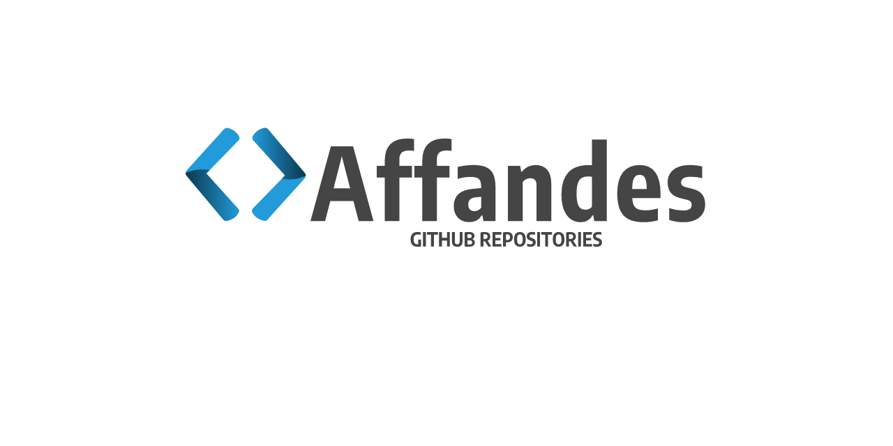

# Modul Praktikum Dasar Pemrograman

Modul praktikum Dasar Pemrograman menggunakan bahasa pemrograman Java. Modul ini digunakan sebagai materi tambahan atau praktikum pada mata kuliah Dasar Pemrograman. 

> Dibuat dan dikelola oleh **Muhammad Affandes, M.T.** ([affandes@uin-suska.ac.id]())

## Silabus

Berikut adalah silabus yang digunakan.

1. Pendahuluan
2. Variabel dan Tipe Data
3. Operator
4. Input dan Output
5. Percabangan
6. Perulangan

## Ada Pertanyaan?

Jika ada pertanyaan dan isu terkait modul ini, silahkan kontak langsung melalui email yang tertera di atas.

## Lisensi

Lisensi di bawah GNU Public License.

Copyright © 2019 oleh Muhammad Affandes